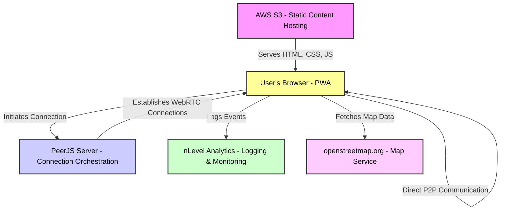
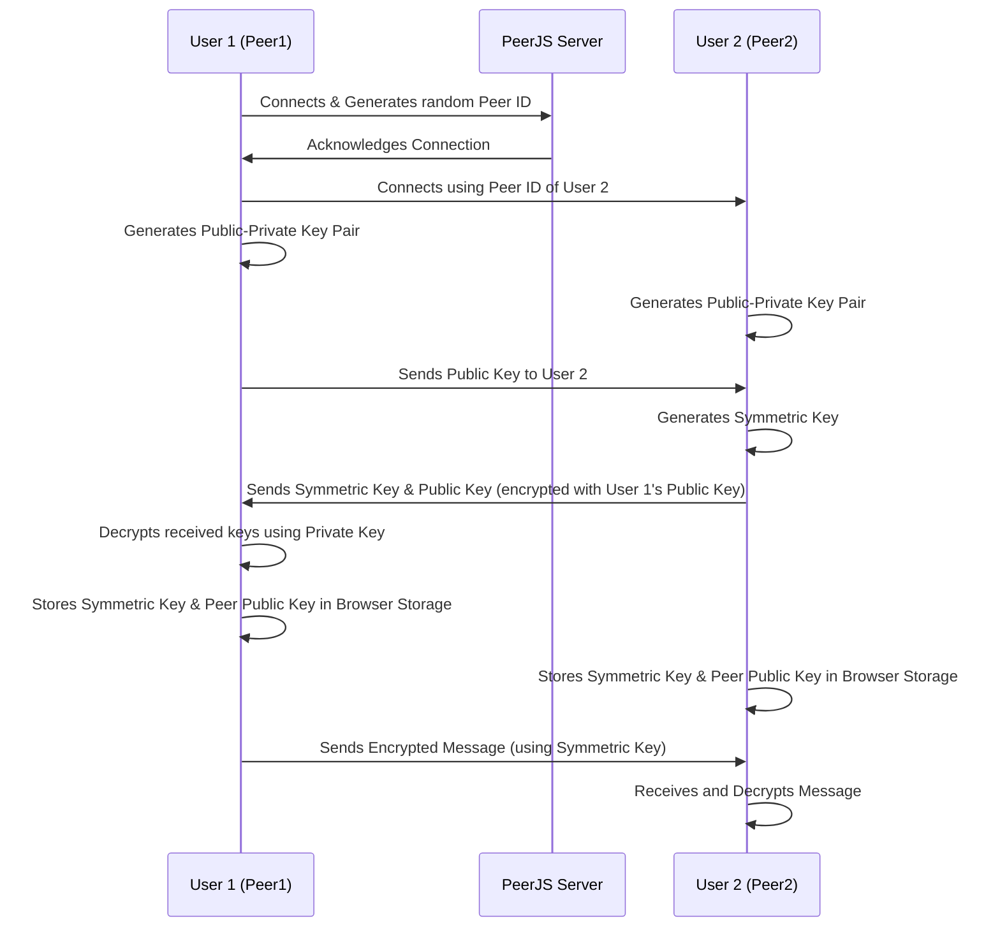

# Chat

> ⚠️ **WARNING:** This project is not production-ready. It is an unstable experimental proof-of-concept and may contain bugs and/or incomplete features. Use it at your own risk.


 
 
 
 
 
 


Discover **Positive Intentions Chat**: A secure, browser-based chat application leveraging WebRTC for decentralized messaging, file sharing, and virtual reality experiences. Prioritizing privacy and user control, it's redefining the way we think about online communication. Join us in shaping the future of chat.

Live app: [chat.positive-intentions.com](https://chat.positive-intentions.com)

Learn more: [positive-intentions.com](https://positive-intentions.com)

Join the conversation: [r/positive_intentions](https://www.reddit.com/r/positive_intentions)


## Getting Started

These instructions will get you a copy of the project up and running on your local machine for development and testing purposes.

### Prerequisites

You need to have Node.js installed on your system to run the app. If you don't have Node.js installed, you can download it from [here](https://nodejs.org/).

### Installing

First, clone the repository to your local machine. Then, navigate to the project directory and install the dependencies.

```bash
npm install --force
npm start
```

This will start the development server and open the app in your default browser. If it doesn't open automatically, you can navigate to [http://localhost:8080](http://localhost:8080) to view the app.

> See the [package.json](package.json) file for more scripts.

#

🚀 **Introducing a groundbreaking chat application that redefines online communication.** Built with a focus on privacy, security, and user control, this app offers a pioneering approach to chatting, file sharing, and exploring virtual spaces—all from within your browser.

🔒 **Privacy by Design**: Leveraging WebRTC for peer-to-peer connections, our app ensures your conversations and files stay between you and your contacts—no middlemen involved. With encryption technologies built into modern browsers, we enable users to manage their encryption keys, ensuring unmatched privacy and security.

🌍 **Decentralized and Empowering**: Say goodbye to the constraints of traditional server-based apps. Our technology allows for decentralized authentication, encrypted messaging, and even decentralized file transfers. Your data, your rules.

🔥 **Feature-Rich Experience**:
- **Secure Messaging**: End-to-end encryption for all messages.
- **File Sharing**: Seamlessly share files with peers using cutting-edge WebRTC technology.
- **Voice and Video Calls**: Connect more personally with high-quality calls.
- **Mixed-Reality Spaces**: Dive into shared virtual environments for a new way of interaction.
- **Image Board**: Share and discover images in a community-driven space.

👾 **Tech for the Future**: Beyond chat, we're exploring virtual reality, enabling users to share 3D positions and live video streams within VR environments. Imagine socializing in a virtual space that's as easy to access as opening your browser.

### Architecture



### Authentication sequence



### Join Us on This Journey

Pushing the boundaries of what's possible with current web technologies to create a chat app that prioritizes user empowerment and privacy. But this is just the beginning. With your support, we can explore new features, refine the user experience, and expand the app's capabilities.

### How You Can Help

- **Feedback**: Your insights are invaluable. Share your thoughts on current features, suggest new ones, or report any bugs you encounter.
- **Development**: Interested in contributing code? [Let's talk!](https://www.reddit.com/r/positive_intentions) While the app isn't fully open-source yet, parts of it are, and I'm keen on opening more in the future.
- **Spread the Word**: Help us grow by sharing the app with others who value privacy and control over their digital communication.
- **Github Stars**: If you like the project, consider starring the repository. It helps others discover it and boosts my motivation.
- **Financial Support**: Development is fueled by passion and coffee. Your sponsorship helps keep both flowing.
